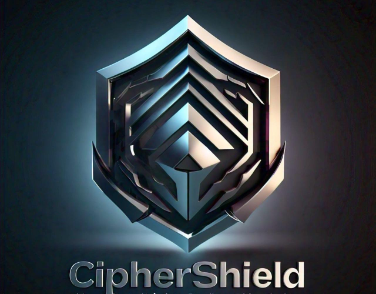

# CipherShield (Flask Application)

 <!-- Placeholder for a logo image -->

## 🛡️ Introduction

**CipherShield** is a state-of-the-art Flask-based application engineered to provide advanced encryption and decryption services, with a particular focus on video file security. Leveraging a hybrid cryptographic approach that combines RSA, AES, and an Elliptic Curve Cryptography (ECC)-inspired key generation algorithm, CipherShield ensures that your digital content remains secure against unauthorized access and piracy. This platform is ideal for scenarios requiring secure video communications and file transmission.

## 🚀 Features

- **🔐 Video Encryption & Decryption**: Securely encrypt and decrypt video files using a hybrid RSA-AES approach with dynamic key generation.
- **🔑 Dynamic Key Management**: Keys are dynamically generated for each video chunk, providing enhanced security.
- **👤 User Authentication**: Robust user authentication and session management for secure access to encrypted files.
- **📊 Metrics Tracking**: Track detailed metrics, including chunking time, encryption/decryption time, key generation delays, and chunk encryption delays.
- **📈 User-Specific Metrics Visualization**: Visualize video processing metrics with user-specific plots.

## 🛠️ Technologies Used

- **Flask**: A lightweight Python web framework.
- **RSA & AES**: Industry-standard cryptographic algorithms.
- **ECC-Inspired Key Generation**: A novel approach for generating independent keys for each video chunk.
- **MySQL**: For storing user data, video metadata, and metrics.
- **Matplotlib**: For generating plots of processing metrics.

## ⚙️ System Requirements

- **Python 3.7+**
- **Flask**
- **MySQL**
- **Cryptography** (Python library)
- **Matplotlib**
- **Git**

## 📥 Installation

### 1. Clone the Repository

Start by cloning the CipherShield repository from GitHub:

```bash
git clone https://github.com/lateefcode2101/CipherShield.git
cd ciphershield
```

### 2. Set Up a Virtual Environment

Create and activate a virtual environment to manage dependencies:

```bash
python3 -m venv venv
source venv/bin/activate   # On Windows use: venv\Scripts\activate
```

### 3. Install Dependencies

Install all necessary Python packages:

```bash
pip install -r requirements.txt
```

### 4. Configure MySQL Database

Set up your MySQL database:

1. Create a database named `cryptdb`.
2. Run the following SQL commands to create the required tables:

```sql
CREATE DATABASE cryptdb;
USE cryptdb;

CREATE TABLE Users (
    user_id INT AUTO_INCREMENT PRIMARY KEY,
    username VARCHAR(50) NOT NULL UNIQUE,
    email VARCHAR(100),
    password_hash VARCHAR(255) NOT NULL
);

CREATE TABLE Videos (
    video_id INT AUTO_INCREMENT PRIMARY KEY,
    title VARCHAR(255),
    description TEXT,
    file_name VARCHAR(255),
    file_path VARCHAR(255),
    uploader_id INT,
    recipient_id INT,
    UUID VARCHAR(255),
    vid VARCHAR(255),
    FOREIGN KEY (uploader_id) REFERENCES Users(user_id),
    FOREIGN KEY (recipient_id) REFERENCES Users(user_id)
);

CREATE TABLE metrics (
    metric_id INT AUTO_INCREMENT PRIMARY KEY,
    Video_id INT,
    file_size FLOAT,
    chunk_time FLOAT,
    encryption_time FLOAT,
    decryption_time FLOAT,
    combine_time FLOAT,
    file_name VARCHAR(255),
    recipient_id INT,
    FOREIGN KEY (Video_id) REFERENCES Videos(video_id),
    FOREIGN KEY (recipient_id) REFERENCES Users(user_id)
);

CREATE TABLE chunk_delays (
    chunk_id INT AUTO_INCREMENT PRIMARY KEY,
    video_name VARCHAR(255),
    chunk_index INT,
    delay FLOAT
);

CREATE TABLE key_gen_delays (
    key_id INT AUTO_INCREMENT PRIMARY KEY,
    video_name VARCHAR(255),
    chunk_index INT,
    delay FLOAT
);
```

### 5. Configure the Application

Update the database settings in the `app.py` file:

```python
app.config['MYSQL_HOST'] = 'localhost'
app.config['MYSQL_USER'] = 'your_mysql_user'
app.config['MYSQL_PASSWORD'] = 'your_mysql_password'
app.config['MYSQL_DB'] = 'cryptdb'
```

### 6. Run the Application

Start the Flask application:

```bash
export FLASK_APP=app.py
export FLASK_ENV=development
flask run
```

Or on Windows:

```bash
set FLASK_APP=app.py
set FLASK_ENV=development
flask run
```

The application will be accessible at `http://127.0.0.1:5000/`.

## 📚 Application Utilization

### 1. 📝 User Registration

- Open the application in your browser.
- Navigate to the `Register` page to create a new account by entering your username, email, and password.

### 2. 🔓 User Login

- Log in with your registered credentials to access the application features.

### 3. 📤 Uploading Videos

- Go to the `Upload` page.
- Provide the video title, description, select a recipient from the dropdown, enter the recipient's UUID, and select the video file to upload.
- Click `Upload` to securely encrypt and store the video.

### 4. 📺 Viewing Videos

- Navigate to the `Home` page to see the list of uploaded videos.
- Click on a video title to decrypt and play the video.

### 5. 📊 Viewing Metrics

- Go to the `Metrics` page to view detailed metrics of your uploaded videos.
- Metrics include chunking time, encryption time, decryption time, and more, with visual plots for analysis.

## 🔐 Security Considerations

- **Dynamic Key Generation**: Each video chunk is encrypted with a unique, dynamically generated key, making it difficult for adversaries to compromise the entire video.
- **Independent Key Generation**: Even if one key is compromised, subsequent keys remain secure, maintaining the overall security of the video.

## 🛠️ Contributing

Contributions are welcome! If you have ideas for improvement or new features, please fork the repository and submit a pull request.

## 📜 License

This project is licensed under the MIT License. See the `LICENSE` file for more details.
